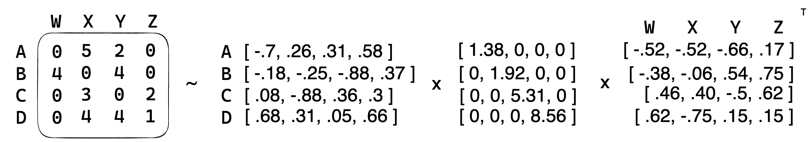

---
jupytext:
  formats: md:myst
  text_representation:
    extension: .md
    format_name: myst
kernelspec:
  display_name: Python 3
  language: python
  name: python3
---

(chapter1_part5)=

# Collaborative Filtering

Collaborative filtering is a powerful method for recommendation systems used to predict user preferences or
interests. It is based on the notion that people who have similar tastes and preferences in one domain are likely
to have similar tastes and preferences in a different domain. The collaborative filtering technique seeks to identify
users who have similar tastes and preferences, based on their past interactions, and then use those users'
interactions of items to predict relevance of similar items for the user. The goal of collaborative filtering is
to use the opinions of other people to make predictions about a user’s preferences and interests.
This is done by finding users who have similar tastes and preferences as the user in question, and then using
those users’ ratings of items to make predictions about how the user would rate the same items.
There are two main approaches to collaborative filtering: memory-based and model-based. 

## Memory-based Collaborative Filtering
Memory-based collaborative filtering, also known as neighborhood-based collaborative filtering, is an approach
that relies on finding similar users or items based on their behavior or preferences. The basic idea is to use
the ratings or interactions of users with items to identify other users who have similar tastes, and then use
the ratings of those similar users to make recommendations to a target user. One common approach in memory-based
collaborative filtering is user-based collaborative filtering. In this approach, the similarity between users is
calculated based on their ratings for items. A similarity metric such as the cosine similarity or Pearson correlation
coefficient is often used to measure the similarity between two users. The similarity scores are then used to
identify the most similar users to the target user. Once the most similar users are identified, their ratings
for items are used to generate recommendations for the target user. Item-based collaborative filtering is another
common approach in memory-based collaborative filtering. In this approach, the similarity between items is calculated
based on the ratings of users who have rated both items. The similarity scores are then used to identify items that
are similar to the items that the target user has already rated highly. Once the similar items are identified,
they are recommended to the target user. One advantage of memory-based collaborative filtering is that it is easy
to implement and interpret. The algorithm is relatively simple and does not require a lot of computational resources.
Additionally, memory-based collaborative filtering can be effective when there is a lot of data available and the
user-item matrix is sparse. However, memory-based collaborative filtering also has several disadvantages.
One major limitation is that it is prone to the cold-start problem, which occurs when there is not enough data
available to identify similar users or items. Additionally, memory-based collaborative filtering can be
computationally expensive when there are a large number of users or items.

Let's consider an example with Pearson Correlation
Say, we have a dataset that contains the ratings of four users on five movies. The data looks like this:

|         | User A | User B | User C | User D |
|-------- | -------- | ------- | ------- | -------- |
|Movie 1 | 5 | 4 | 2 | 3 | 
|Movie 2 | 3 | 3 | 4 | 4 | 
|Movie 3 | 4 | 4 | 5 | 5 |
|Movie 4 | 1 | 2 | 1 | 2 |
|Movie 5 | 2 | 1 | 3 | 3 |


To apply collaborative filtering, we can compute the similarity between each pair of users based on their 
ratings. The similarity is calculated using the Pearson Correlation Coefficient (PCC). The PCC is a measure
of how well two sets of data are correlated, and it ranges from -1 (perfectly negatively correlated) to +1
(perfectly positively correlated). For example, let’s assume that we want to find the similarity between
User A and User B. The PCC is calculated by taking the average of the product of the ratings for each movie.
So, let's get PCC for User A and User B:

```{code-cell} ipython3
import numpy as np

user_a = [5, 3, 4, 1, 2]
user_b = [4, 3, 4, 2, 1]

print(f'Pearson Correlation for user A and B is: {np.corrcoef(user_a, user_b)[0, 1]}')
```

It indicates that `User A` and `User B` have a strong positive correlation in their ratings.
To find recommendations for `User A`, we can first identify the users who are most similar to `User A`.
In this example, that would be `User B` and `User C` (check it out by calculating other pairs).
Next, we can take the weighted average of the ratings from those users for the movies that `User A`
has not yet rated. For example, let’s assume that `User A` has not yet rated Movie 4. We can then take
the weighted average of the ratings for Movie 4 from `User B` and `User C`.  `User B` rated Movie 4 a 2,
and `User C` rated it a 1. We can then take the weighted average of those ratings, giving more weight 
to `User B` since they are more similar to `User A`. In this case, the weighted average would be around 2.
Therefore, based on the ratings from other users, it is likely that `User A` would rate Movie 4 a 2.

To wrap up, we can say that memory-based collaborative filtering as about calculating similarity
between rows or columns of interaction matrix. In our example, we took columns a.k.a user similarities
while we could take item-item similarities and use as recommendation.


## Model-based Collaborative Filtering
Model-based collaborative filtering is an approach that uses machine learning algorithms to learn a model from 
the ratings or interactions of users with items. The model is then used to make predictions about the relevance of
users for items that they have not yet interacted with. One common approach in model-based collaborative filtering
is matrix factorization. In this approach, the user-item matrix is decomposed into two lower-dimensional matrices:
a user matrix and an item matrix. The user matrix represents the latent preferences of users, and the item matrix
represents the latent attributes of items. The dot product of the user and item matrices gives the predicted relevance
for a user-item pair. Matrix factorization is typically performed using a technique called Singular Value Decomposition (SVD).
The example of how it is computed is showed below. Basically, we have interactions data where rows represent
users and columns their ratings/other interactions. Based on thatm we have find such matrices that would approximate
this relationship from our interactions data. It worth mentioning, that by SVD we only try to approximate rather
than being able to restore interactions matrix fully. Thus, we take *k* biggest singular values from sigma (middle) matrix


*Toy example with SVD decomposition*

However, SVD is computationally expensive and may not scale well to large datasets. Therefore, alternative techniques
such as Alternating Least Squares (ALS) or modification for implicit target iALS, Stochastic Gradient Descent (SGD)
are often used. Another common approach in model-based collaborative filtering is deep learning.
In this approach, a neural network is used to learn a representation of users and items.
The network takes as input the ratings or interactions of users with items and outputs a prediction of the rating for a
user-item pair. Deep learning has the advantage of being able to capture complex patterns in the data and can be used
to learn non-linear relationships between users and items. One of the popular examples is Extreeme Deep Factorization machines (xDeepFM).
One advantage of model-based collaborative filtering is that it can handle the cold-start problem by using the
learned model to make predictions about items that have not yet been rated by users. Additionally, model-based
collaborative filtering can be more accurate than memory-based collaborative filtering, especially when there are
a large number of users and items. Obviously, if we have enough data we can generate more accurate predictions minimizing our loss function
However, model-based collaborative filtering also has some disadvantages. One major limitation is that it can be
difficult to interpret the learned model and understand why certain recommendations are being made. Additionally,
model-based collaborative filtering can be computationally expensive and may require a lot  of computational resources,
especially when using deep learning techniques. Another disadvantage of model-based collaborative filtering is that it
requires a large amount of data to train the model effectively. This can be a challenge in some domains, where there
may be a limited amount of data available. In these cases, memory-based collaborative filtering may be a better choice.

**TODO ADD PYTHON CODE FOR COLLABORATIVE FILTERING HERE HERE**

## Hybrid Approaches
In practice, many recommender systems use a hybrid approach that combines both memory-based and model-based
collaborative filtering. In a hybrid approach, the strengths of both approaches are leveraged to improve the
accuracy and performance of the recommender system. One common approach in hybrid collaborative filtering is
to use a memory-based approach to generate initial recommendations and then refine the recommendations using
a model-based approach. This approach can be effective in situations where there is not enough data to train
a model effectively but there is enough data to identify similar users or items using a memory-based approach.
Another approach is to use a model-based approach to generate initial recommendations and then refine the
recommendations using a memory-based approach. This approach can be effective in situations where the user-item
matrix is very sparse and a model-based approach is needed to make accurate predictions.
