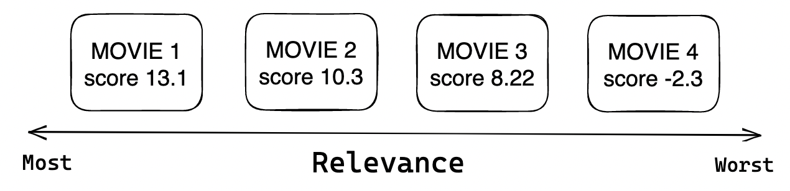

---
jupytext:
  formats: md:myst
  text_representation:
    extension: .md
    format_name: myst
kernelspec:
  display_name: Python 3
  language: python
  name: python3
---

(chapter1_part6)=

# Ranking Problem
The ranking problem is a type of supervised or semi-supervised learning problem where the goal
is to predict the relative order of a set of items. It is commonly used in search engines,
recommender systems, and other applications where the order of the response is vital. Ranking
models usually try to predict a relevance score and sorting is made based on these scores.
Strictly speaking, $s = f(x)$, $s$ - stands for ranking model and for each
input $x = (q, d)$ where $q$ is a query and $d$ is a document we predict *relevance scores*

Depending on the context and business needs, prediction of relevance score can be considered as:
- `Binary classification` - whether user will click on recommended movie;
- `Regression` - prediction of watch time by a user for particular recommended movie;
- `Learning-to-rank`

Considering that the first two tasks are quite widespread, here we will focus in learning-to-rank
class of models. So, why do we have distinct class of learning-to-rank models while it still?
The main difference between learning to rank and classification/regression models is that
classification/regression models predict a label or value for a single input,
while learning to rank models predict a ranking for a list of inputs. Basically, you have a
list of items and you can make pair comparison within this set and decide the order within that
set. In case of regression / classification, you will not be able to do that.



# Training learnig-to-rank models
In learning-to-rank pipeline there are three approaches to train the model:
- `Pointwise`: basically, it takes single item from a list and computes loss using
only its information. It resembles the same as if classifier / regressor is trained;
Some examples: cosine distance between embeddings, logistic regression based some 
features with binary relevance target etc, BM25 (it is "advanced" version of tf-idf).

- `Pairwise`: in this approach a pair of documents is used to minimize the loss.
The idea is to minimize the number of swaps in final ordered list. Some of the most
popular methods are [RankNet, LambdaRank and LambdaMART](https://www.microsoft.com/en-us/research/wp-content/uploads/2016/02/MSR-TR-2010-82.pdf);

In this approach, there are three main methods to train the model - `RankNet`, `LambdaRank` & `LambdaMART`:

**RankNet**

This cost function tries to minimize the number of swaps in the final ordered list. Originally,
it was developed for optimization parameters in neural nets, but in genral the underlying model
can be set to any. The formula:

$P_{ij} \equiv P(U_{i}>U_{j}) \equiv \frac{1}{1 + \exp^{-\sigma(s_{i} - s{j})}}$

Instead of directly predicting the score of each item one by one, RankNet proposed
to model the target probabilities between any two items. For instance, 
taket 3 movies: `movie 1`, `movie 2` and `movie 3` with scores 0, 5, 3 respectively.
The 3 distinct combinations give us `P(movie 1 & movie 2) = 0`, `P(movie 1 & movie 3) = 0`
and `P(movie 2 & movie 3) = 1` - this is considered as one training sample and model tries
to model this distribution. 

**LambdaRank**

It was derived after `RankNet`, researchers found that during the process you do not need values of costs,
but only the gradients of the cost w.r.t model score. The formula that explains the idea 
with NDCG is the following:

$\lambda_{ij} = \frac{\partial C(s_{i} - s_{j})}{\partial s_{i}} = \frac{-\alpha}{1 + \exp^{\alpha(s_{i} - s_{j})}}|\Delta NDCG|$,
where C is the cost function, $\delta NDCG$ stands for how much NDCG will change if swap *i* and *j*

**LambdaMART**

This approach combines `LambdaRank` &  `Multiple Additive Regression Trees (MART)`. The approach is
quite straightforward: we use gradient boosted trees for prediction task and incorporate `LambdaRank`
cost function into the model to convert it to solve ranking problem. On experimental data, this
method outperformed `RankNet` & `LambdaRank`. However, both Pointwise and Pairwise methods
fail to determine the impact of the whole group (list of items). Here comes the next method

- `Listwise`: as in the naming, it takes the whole list of candidates at once and tries to rank
documents within optimally. Fot that it uses two approaches:
1. Direct optimization of information retrievals (IR) metric such as NDCG via approximation
with [SoftRank](https://www.microsoft.com/en-us/research/wp-content/uploads/2016/02/SoftRankWsdm08Submitted.pdf) / [AdaRank](https://www.semanticscholar.org/paper/AdaRank%3A-a-boosting-algorithm-for-information-Xu-Li/a489d95fb930401c1f4b7d92bb139d271d49abbf);
2. Minimization of the loss that is defined based on you domain knowledge of what you are trying to achieve.
These are ListNet, ListMLE losses.


There are two methods in listwise approach - `ListNet` & `ListMLE`. These are two most popular ones.
In this task, each item has a set of features that describe its properties and relevance to the query.
The goal is to learn a ranking function that maps these features to a ranking order.

**ListNet**

It is a listwise version of aforementioned `RankNet`. It usses cross-entropy loss function along
with gradient descent to optimize parameters for neural net. In cases when we have only two items
in a list the result of the `ListNet` coincides with `RankNet`. The idea behind ListNet is to learn
a probability distribution over the permutations of the items in the list, such that the more
relevant items appear at the top of the list with higher probability. The training objective 
of ListNet is to maximize the likelihood of the ground-truth permutation, which is the permutation
that corresponds to the actual relevance of the items. This is done by minimizing the cross-entropy
loss between the predicted and ground-truth probability distributions.
So, how do we get probabilities in the first place and how permutations are involved? Let's go step-by-step.

Let's assume, we have three movies to rank `The Godfather`, `Avatar`, & `Ozark`
What are all possible permutations for these three objetcs?

```{code-cell} ipython3
from itertools import permutations

movies_to_rank = {'The Godfather', 'Avatar', 'Ozark'}
permutations_list = list(permutations(movies_to_rank))

for i in permutations_list:
    print(i)
```
Now, we have all possible permutations for this object and, say, we predicted some scores that can be
used to rank these objects. Next, we are interested in how we can use these scores to determine
which permutation of all combinations are more relevant then other? Here is the how it proposed in the
[paper](http://times.cs.uiuc.edu/course/598f14/l2r.pdf)

$P_{s}(\pi) = \prod^n_{j = 1} \frac {\phi(s_{\pi(j)})} {\sum^n_{k = j} \phi(s_{\pi(k)})}$

Wow, that's a big formula. Let's break it down:
- We calculate the probability for a particular permutation $\pi$ given some predicted scores $s$;
- Big $\prod$ stands for calculation of the product of $n$ terms (permutations);
- Next, $\phi$ is transformation function with a required property - `an increasing and strictly positive function`
i.e. the higer predicted score $s$ the higher value of the function

Considering our example, we can continue by generating some random score as our predictions and pick one
of the permutations randomly

```{code-cell} ipython3
import numpy as np
np.random.seed(42)

scores_dict = {x: np.random.randn(1)[0] for x in movies_to_rank}  
print(scores_dict)
```

```{code-cell} ipython3
import random

pi = random.choice(permutations_list)
print(pi)

# unpack pi and assign movies to scores
score_movie_pos_1, score_movie_pos_2, score_movie_pos_3 = scores_dict[pi[0]], scores_dict[pi[1]], scores_dict[pi[2]]
```
Now, we can move to use our aforementioned formula using these numbers. There are going to be three
terms with combinrations: The Godfather vs The Godfather  + Avatar + Ozark, Avatar vs Avatar + Ozark
and finally Ozark vs Ozark

```{code-cell} ipython3
first_term = np.exp(score_movie_pos_1) / (np.exp(score_movie_pos_1) + np.exp(score_movie_pos_2)\
                                         + np.exp(score_movie_pos_3))

second_term = np.exp(score_movie_pos_2) / (np.exp(score_movie_pos_2) + np.exp(score_movie_pos_3))

third_term = np.exp(score_movie_pos_3) / np.exp(score_movie_pos_3)

print(f'First term is: {first_term}')
print(f'Second term is: {second_term}')
print(f'Third term is: {third_term}')
```
What we have done so far? $P_{s}(<The Godfather, Avatar, Ozark>) = \prod^3_{j = 1} \frac {\phi(s_{\pi(j)})} {\sum^3_{k = j} \phi(s_{\pi(k)})}$ which is equal to

```{code-cell} ipython3
permutation_proba = first_term * second_term * third_term

print(f'Permutation probability is: {permutation_proba}')
```
In this manner, we can calculate permutation probability for each set in our list of all permutations.
Thus, the final probabilities will sum up to 1 and we can sort using this probabilities! Now,
we know how to get probability distributions of permutations. So far, we used some random numbers
to calculate this, but how do we really get these scores in real life? To get scores
Neural Network model is used. We define any architecture and feed `query - document` features
and use cross-entropy / KL-divergence to train the model. Thanks to this [source](https://embracingtherandom.com/machine-learning/tensorflow/ranking/deep-learning/learning-to-rank-part-2/), all futher details can be find there.
Finally, it worth mentioning that calculating all permutations are too computationally expensive
and authors propose `Top One Probability` method to avoid calculation of all permutations.


**ListMLE**

ListMLE is another learning to rank method that uses a maximum likelihood estimation (MLE)
framework to learn the ranking function. The idea behind ListMLE is to directly model the
likelihood of the ground-truth permutation, rather than the probability distribution.
The training objective of ListMLE is to maximize the log-likelihood of the ground-truth
permutation under the Mallows model. This is done by minimizing the negative log-likelihood,
which is equivalent to minimizing the Kendall tau distance between the predicted
and ground-truth permutations. 

More detailed explanation of these three approaches in learning-to-rank tast are explained
here.
